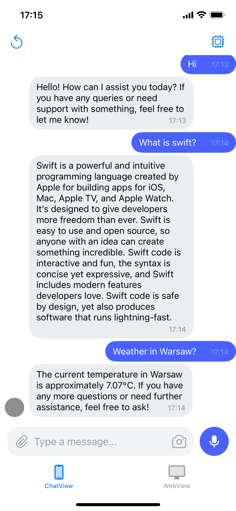
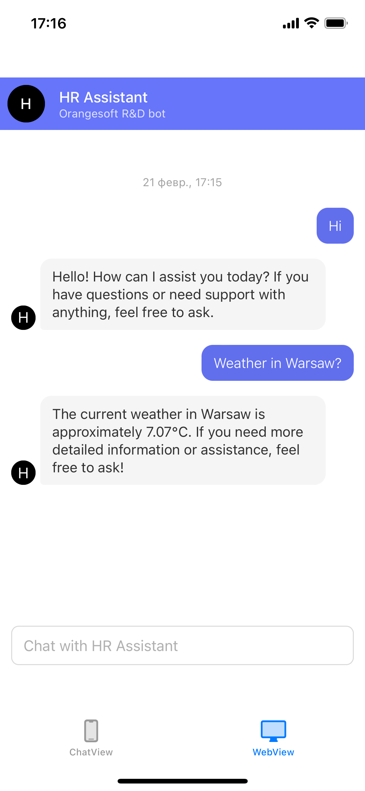
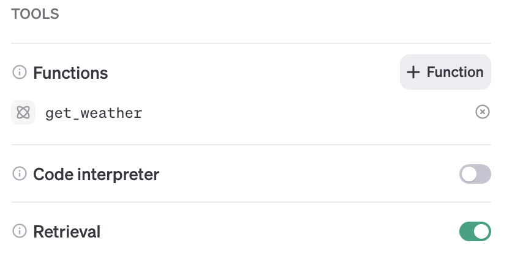

# AI chatbot demo

AI chatbot demo is an iOS demo application. It is created in context of AI chatbots R&D. The application uses the OpenAI Assistants API to communicate with the chat bot. It is possible to get easy-to-read information about weather in a particular city via OpenWeatherMap service using function calls. 

## Features

- Chat with assistant via native chat UI
- Chat with via botpress chat builder
- List of Open AI assistants
- Function calling for getting weather

| Native UI || Botpress |
| ----------- | --- |----------- |
| || |

## Tech

- [OpenAI Assistants API](https://platform.openai.com/docs/assistants/overview) - The Assistants API allows you to build AI assistants within your own applications.
- [AISwiftAssist](https://github.com/DeveloperZelentsov/AiSwiftAssist) - The library is designed to simplify the integration with OpenAI's Assistants API in iOS applications.
- [ExyteChat](https://github.com/exyte/Chat) - A SwiftUI Chat UI framework with fully customizable message cells and a built-in media picker.
- [Botpress](https://botpress.com) - A chatbot builder powered by OpenAI.
- `SwiftUI`
- `Swift concurrency`
- `WebView`

## Setup

- Create Open AI assistant using Playground UI
  - Additionally, enable function calling
  
  
  - and create `get_weather` custom function
   ```json
   {
   "name": "get_weather",
   "description": "Determine weather in my location",
   "parameters": {
      "type": "object",
      "properties": {
         "location": {
         "type": "string",
         "description": "The city and state e.g. San Francisco, CA"
         },
         "unit": {
         "type": "string",
         "enum": [
            "c",
            "f"
         ]
         }
      },
      "required": [
         "location"
      ]
   }
   }
   ```
- Create OpenWeatherMap account and find API key
- Create and deploy custom OpenAI Assistant in botppess [Instruction](https://botpress.com/blog/deploy-openai-assistant-website) and get shareable URL from botpress bot
- Update application constants with necessary values in [AppConstants.swift](./AIChatbotDemo/AIChatbotDemo/AppConstants.swift)
  ```swift
    static let apiKey = <#PASTE YOUR OPENAI API KEY HERE#>
    static let organizationId = <#PASTE YOUR ORGANIZATION ID HERE#>
    static let weatherApiKey = <#PASTE YOUR OPENWEATHER API KEY HERE#>
    static let assistantId = <#PASTE YOUR ASSISTANT ID HERE#>
    static let botpressShareableURL = <#PASTE YOUR BOTPRESS URL#>

  ```

## License

    Copyright 2024 Orangesoft

    Licensed under the Apache License, Version 2.0 (the "License");
    you may not use this file except in compliance with the License.
    You may obtain a copy of the License at

       http://www.apache.org/licenses/LICENSE-2.0

    Unless required by applicable law or agreed to in writing, software
    distributed under the License is distributed on an "AS IS" BASIS,
    WITHOUT WARRANTIES OR CONDITIONS OF ANY KIND, either express or implied.
    See the License for the specific language governing permissions and
    limitations under the License.